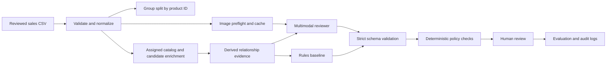

# Questionable eBay Sales Review Job Design

**Status:** implemented POC with deterministic baseline; multimodal provider ready for configured credentials  
**Scope:** PriceCharting trading-card sales only  
**Decision owner:** PriceCharting  
**Primary artifact:** reviewed questionable-sales export

## 1. Executive decision

Build a relationship-first evidence pipeline, not a generic image classifier and not an anomaly
detector that equates price outliers with bad sales. For each sale, compare the listing title,
assigned product, assigned condition, current product metadata, condition-specific price anchors,
and listing image. A reviewer returns one semantic decision:

- `ignored`: product and condition are sufficiently supported.
- `deleted`: the listing should not be tracked as a comparable single-card sale.
- `condition_change`: the product is right but the condition is wrong, with an exact replacement
  condition ID.

`needsMod` is not modeled as a fourth semantic decision. It means the historical review needed
modification, but it does not specify the correct sale outcome. It is retained as a weak routing
proxy and must be relabeled before it can become authoritative escalation ground truth.

The system does not request, store, or route on model-generated confidence. Every result routes to
human review. Any future probability must be calculated outside the model and calibrated against
independently adjudicated, product-grouped examples.

## 2. Assumptions challenged

### 2.1 “98% contractor accuracy” is not model-ready ground truth

The source email describes an aggregate audit estimate. It does not provide sampling method,
class-specific error rates, exact condition-ID accuracy, adjudication rules, or uncertainty.
Treating every row as equally authoritative would encode reviewer noise. The POC reports results
against these labels but calls them historical labels, not truth. Before production, draw a
stratified sample and obtain two independent expert reviews plus adjudication.

### 2.2 `needsMod` is not a sale class

The label names a workflow event, while `ignored`, `deleted`, and condition slugs name outcomes.
Combining them in one four-class accuracy score mixes two questions and makes errors impossible to
interpret. We instead evaluate resolved decisions on three classes and report whether rows marked
`needsMod` were routed to a human as a separate, explicitly weak proxy.

### 2.3 Price anomaly is not sale invalidity

A legitimate rare parallel, low-volume card, auction, stale catalog anchor, or poorly titled sale
can be far from a current guide price. Price distance can corroborate a title/image mismatch and
prioritize review, but cannot independently delete a sale or change its condition.

### 2.4 Random row splits leak product identity

The export has 10,000 rows but only 3,029 products; 8,246 rows belong to repeated-product groups.
A random row split lets examples for the same product appear in development and test, overstating
generalization. Splits are therefore deterministic and grouped by normalized `unified-id`.

### 2.5 Computer vision should not begin as a separate custom model

The decisions require semantic relationships: whether the pictured card matches a catalog item,
whether a slab label supports the title, and whether multiple visible cards indicate a lot. A
general multimodal model can perform these jointly and return observable fields. A separate OCR or
detector adds operational complexity before its incremental value is known. Run image ablations
first; add dedicated OCR only if slab-label extraction is a measured bottleneck.

### 2.6 Accuracy alone is unsafe

Class imbalance allows a model to look adequate by predicting `ignored`. Required reporting is
macro-F1, per-class precision/recall, exact condition-ID accuracy, confusion matrices, coverage,
covered accuracy, and error slices. The key business curve is error rate versus automated
coverage, not maximum raw accuracy.

## 3. Observed data contract

The labeled export contains:

| Field | Use | Guardrail |
|---|---|---|
| `identifier` | Stable sale key and image-cache namespace | Store as string; source values can exceed conventional integers |
| `status` | Historical outcome label | Decode condition slugs; never send to the model |
| `review-date` | Temporal audit and drift analysis | Never use as a predictive feature |
| `most-recent-report` | Recency/staleness analysis | Never use as a predictive feature |
| `unified-id` | Product enrichment and split group | Strip the leading `G`; validate digits |
| `product-title` | Assigned catalog identity | Compare with sale title and image |
| `sale-title` | Primary listing evidence | Parse exclusions and explicit grading evidence |
| `sale-amount-pennies` | Condition-price relationship | Integer pennies; corroboration only |
| `score` | Upstream questionable-sale rank | Analyze for sampling; do not assume calibrated probability |
| `broad-category` | Scope/filter | POC is restricted to trading cards |
| `condition-id` | Condition present when reviewed | Compare with the review action in `status` |
| `picture-url` | Visual evidence | Fetch defensively; 151 of 10,000 are absent |

Observed profile as of the supplied export:

- 10,000 rows, 3,029 unique products, and largest product group of 203.
- Raw statuses contain 4,565 `ignored`, 3,665 `deleted`, 1,593 condition-button actions, and
  177 `needsMod`.
- The 1,593 condition-button actions resolve to 916 same-condition confirmations and 677 actual
  condition changes. Semantic targets are therefore 5,481 ignored, 3,665 deleted, 677 condition
  changes, and 177 unresolved `needsMod`.
- 9,849 rows have image URLs (98.49% nominal coverage).
- Sale amounts range from 1 to 32,570,000 pennies, so robust/log-scale price features are required.

## 4. Condition mapping

Internal export statuses are decoded through the PriceCharting API documentation mapping:

| Status slug | ID | Meaning |
|---|---:|---|
| `used` | 1 | Ungraded |
| `new` | 2 | Grade 8 |
| `cib` | 3 | Grade 7 |
| `gradednew` | 5 | Grade 9 |
| `boxonly` | 6 | Grade 9.5 |
| `manualonly` | 7 | PSA 10 |
| `looseandbox` | 8 | BGS 10 |
| `looseandmanual` | 9 | Grade 1 |
| `boxandmanual` | 10 | Grade 2 |
| `gradedcib` | 13 | Grade 3 |
| `gradefour` | 14 | Grade 4 |
| `gradefive` | 15 | Grade 5 |
| `gradesix` | 16 | Grade 6 |
| `gradeseventeen` | 17 | CGC 10 |
| `gradeeighteen` | 18 | SGC 10 |

The catalog also recognizes IDs 19 to 22 for CGC 10 Pristine, BGS 10 Black, TAG 10, and ACE 10.
Mapping is versioned in code and unknown statuses fail ingestion rather than silently becoming an
“other” class.

## 5. Available product enrichment

The implementation supports both bulk price-guide CSVs and the documented product API. Relevant
replacement products are retrieved through `/api/products`, deterministically ranked using
listing/catalog identity markers, and enriched with catalog pages and images whose displayed
PriceCharting IDs must match. A proposed replacement is not accepted merely because it ranked
first; it must be selected from this verified set and visually matched to the listing.
Available fields include product ID/name, console or card category, release date, genre/set-like metadata,
sales volume, external identifiers, and condition-specific price columns. CSV lookup is preferred
for batch cost and repeatability; the API fills misses and supports online checks.

Not every condition has a price anchor for every product. Missing anchors remain missing and are
not imputed. Product responses and images are cached locally; credentials are never written to
cache keys, outputs, prompts, or proof files.

## 6. Architecture

### 6.1 Ingestion

The reader enforces the exact required columns, known status slugs, numeric money/condition/score,
and valid product IDs. It fails with the source row number. Labels stay on the stored record for
evaluation but are explicitly removed from provider prompts.

### 6.2 Product evidence

For offline batches, load one or more category CSV exports into an in-memory product index. For
online misses, call `/api/product` at no more than approximately one request per second and cache
the response by product ID. On enrichment failure, retain sale-export product title as degraded
evidence and route conservatively rather than dropping the row.

### 6.3 Image evidence

The fetcher accepts JPEG, PNG, and WebP only, limits payloads to 12 MB, stores a SHA-256 digest,
and records explicit unavailable/unusable reasons. The provider receives image bytes as data URLs,
not expiring URLs.

Multimodal product verification requires two labeled images: the eBay listing image and the
assigned PriceCharting catalog image. The catalog page is derived from API product metadata, and
its displayed PriceCharting ID must equal the assigned product ID before its artwork is trusted.
Missing or failed listing images are valid degraded cases, not job failures. Missing, unverified,
or failed catalog artwork prevents an unqualified product-match decision and forces
`needs_modification`.

### 6.4 Derived evidence

- Normalized token coverage from assigned product metadata into the sale title.
- Explicit deletion indicators: lots/bundles, custom/proxy, damaged, and non-card accessories.
- Grade extraction only with grading-company or grade language; card number `#10` is not a grade.
- Title grade mapped to the exact PriceCharting condition ID.
- Ratio between sale amount and each available condition price, nearest and runner-up anchors.
- Evidence count and missing metadata indicators.
- Explicit identity contradictions such as Championship '23 versus Championship 2024.

### 6.5 Reviewer contract

The reviewer returns a validated JSON object with decision, replacement condition when required,
reason, rationale codes, structured visual observations, consistency observations, model/provider
identity, latency, token counts, and optional cost. It does not return confidence or select routing.
The application applies deterministic safety checks and requires human approval. Contract rules:

- `condition_change` requires `predicted_condition_id`.
- Other semantic decisions forbid a replacement condition.
- `needs_modification=true` requires `human_review` and may omit a semantic decision.
- Invalid provider JSON gets one explicit repair attempt; a second failure becomes a row-level
  model error and must route to a human in the production job runner.

## 7. Decision policy

Evidence should be evaluated in this order:

1. Is this a comparable single-card sale at all? Lots, proxies, accessories, and materially damaged
   cards are deletion candidates.
2. Does the title and image support the assigned product? Strong conflicts require deletion or
   human review, not an automatic condition change. A valid single-item sale assigned to another
   product or variant is a product-reassignment candidate (`needs_modification`), not a deletion
   solely because it mismatches the current product.
3. If product identity is supported, does explicit title/slab evidence support a different grade?
4. Does price broadly support or contradict that interpretation? Price is corroborating evidence
   and cannot create the decision or an acceptance score.
5. Are the image, catalog, and listing internally consistent and sufficiently observable? If not,
   route to human review.

The deterministic baseline intentionally covers only explicit signals. Explicit identity
contradictions override a model match. The multimodal prompt asks for observations before
conclusions and forbids inference of invisible details.

## 8. Evaluation design

### 8.1 Dataset partitions

- Development, validation, and final partitions are assigned by SHA-256 hash of
  `seed:product_id`.
- Every product inspected in an earlier pilot is forced into development before validation or
  final sampling.
- The current locked split has 6,500 development rows, 1,597 validation rows, and 1,903 final
  rows, with zero product overlap.
- Prompt, policy, and threshold work uses validation only. The CLI refuses final evaluation unless
  the operator supplies the explicit `--unlock-final-holdout` flag.
- Source-file and partition fingerprints are written to each pilot manifest.
- Add a future temporal holdout once multiple export windows are available.

### 8.2 Required metrics

- Macro-F1 and per-class precision/recall/F1 for resolved semantic decisions.
- Deletion precision, because false deletion can corrupt price history.
- Condition-change recall and exact replacement-condition accuracy.
- Confusion matrix and error slices by category, original condition, image availability, score band,
  sale-price band, product frequency, and grading company.
- Resolved-decision coverage and accuracy among non-escalated decisions.
- Unresolved-evidence escalation rate and estimated cost/1,000 sales.
- Historical `needsMod` escalation correlation reported as a proxy only; it is not ground truth for
  the final product change.

### 8.3 Baseline proof

After applying the confirmed same-condition-button semantics, the rules baseline produced:

- 0.5958 three-way decision accuracy and 0.3993 macro-F1.
- 0.5886 deletion precision and 0.0888 deletion recall.
- 0.7544 condition-change precision and 0.1955 condition-change recall.
- 41 exact condition IDs correct across 220 condition-change rows (18.64% overall).
- 95.35% exact ID accuracy conditional on the rules emitting a condition change.
- The superseded score-threshold experiment covered 1.45% at 0.95 with 79.07% covered accuracy.

This is not a release candidate. The narrow explicit-grade rule is precise but misses most cases,
and that historical score-threshold slice was too inaccurate. No model-generated confidence or
automatic acceptance threshold remains active. These numbers establish the minimum the multimodal
approach must beat.

### 8.4 Multimodal experiment matrix

Run the same fixed sample through:

1. Majority-class baseline.
2. Current deterministic relationship rules.
3. Text plus catalog metadata, no image.
4. Image plus title, no price anchors.
5. Full image, title, catalog, condition, and price relationship packet.
6. Full packet plus dedicated OCR only if experiment 5 exposes slab-label reading failures.

Use at least two model/provider candidates. Repeat a stability subset three times at temperature
zero, because vendor implementations can still vary. Review disagreements blind to model identity.

### 8.5 Release gates

Do not automate decisions until PriceCharting chooses business tolerances. Proposed POC gates for
discussion, not assumed requirements:

- Deletion precision at or above 99% on at least 300 adjudicated deletion predictions.
- Exact condition-ID precision at or above 98% on at least 300 adjudicated change predictions.
- Statistical upper bound on covered error below the agreed tolerance, not just point accuracy.
- At least 20% automation coverage to justify operational complexity.
- No material degradation for missing-image, low-volume, non-English, or rare-condition slices.
- Every malformed, contradictory, or unresolved-evidence row is explicitly escalated.

### 8.6 Reviewer-action semantics confirmed by PriceCharting

The pilot found that 916 of 1,593 condition-status rows (57.50%) have `condition-id` equal to the
condition encoded by `status`. PriceCharting clarified that `status` records the button selected
by the reviewer. A reviewer can confirm an already-correct condition by selecting that condition
button instead of selecting `ignore`; both actions have the same result.

The evaluator therefore translates review actions into semantic outcomes:

- Condition-button ID equals `condition-id`: `ignored` (condition confirmed).
- Condition-button ID differs from `condition-id`: `condition_change`, with the button ID as target.
- Explicit `ignored`: `ignored`.
- `deleted`: `deleted`.
- `needsMod`: unresolved and excluded from final-decision accuracy.

This yields 916 confirmations and 677 actual condition changes. The raw `status` remains preserved
for audit, while the derived semantic target is used for evaluation.

PriceCharting also clarified that most `needsMod` rows have a final outcome only on the internal
sale entity; it is not recorded in this table or a public API. These rows can test conservative
human routing, but cannot provide authoritative final-decision labels without an internal join.

The same pilot also demonstrated that numeric IDs must never be presented without the authoritative
condition catalog. The prompt now includes every condition ID and name and explicitly forbids
inventing mappings.

## 9. Testing strategy

The automated suite covers:

- All observed status mappings and fail-closed unknown labels.
- CSV normalization/profile and product-group leakage prevention.
- Context-aware grade parsing, including protection against card-number false positives.
- Rule decisions and proof that price alone cannot drive deletion/condition changes.
- Price-guide and API parsing, API cache behavior, and credential non-persistence.
- Image MIME validation, hashing, caching, and rejection behavior.
- Provider label blindness, invalid-output repair, and strict condition-ID contract.
- Classification/selective-risk metric math and HTTP health/review endpoints.

Live proof additionally exercises verified TLS, one PriceCharting product call, one eBay image fetch,
cache/hash generation, evidence construction, and the reviewer. A real multimodal inference is not
claimed until a model-provider key and model name are configured.

## 10. Operations and observability

For each run record code version, prompt version, model version, mapping version, input snapshot ID,
split seed, counts by outcome/escalation reason, latency percentiles, token/cost totals, fetch/cache
failure rates, and malformed-output rate. Store immutable input/output records
subject to PriceCharting retention policy; do not store API tokens or duplicate image data in logs.

Retries must be bounded and typed:

- Product API: exponential backoff for 429/5xx; no retry for invalid product IDs.
- Image: limited retry for timeout/5xx; unsupported MIME is terminal.
- Model: retry transport failures; one schema-repair call for invalid content.
- Row errors: dead-letter with reason and route to human; do not fail the entire batch.

Monitor drift in input statuses, condition distribution, missing images, title languages, price
ratios, model decisions, resolved-decision coverage, escalation reasons, and post-review
disagreement. Change evidence policy only through a versioned evaluation when coverage falls.

## 11. Security and privacy

- Secrets are environment variables only; `.env`, caches, and raw exports are Git-ignored.
- Outbound HTTPS uses certificate verification with the packaged CA trust store.
- Product IDs are validated before entering URLs; query parameters are encoded.
- Image type and size are checked before persistence/provider submission.
- Historical labels are stripped from prompts to prevent leakage.
- Prediction checkpoints are keyed by a fingerprint of label-blind evidence, image content,
  model ID, and prompt version; listing ID alone can never authorize reuse.
- Run manifests record the complete input CSV SHA-256 and prompt version.
- Provider data retention and image-use terms require explicit approval before production traffic.
- eBay image retention and PriceCharting API usage must be checked against applicable terms before
  long-lived storage or scaled processing.

## 12. Delivery phases

### Phase A: completed POC foundation

- Data contracts, profile, status mapping, grouped split.
- CSV/API product enrichment and image cache.
- Evidence features, deterministic baseline, strict multimodal adapter.
- CLI, HTTP API, unit/integration tests, diagnostic baseline report, and live enrichment proof.

### Phase B: completed paid model validation and adjudication

- Select a stratified experiment sample, preserving product grouping.
- Run the multimodal ablation matrix and capture cost/latency.
- Double-review disagreements and the `needsMod` subset.
- Fit calibration on validation predictions and choose thresholds from business constraints.
- Evaluated once on the locked final holdout and wrote the POC decision memo.

### Phase C: production hardening if gates pass

- Durable queue/job runner, bounded concurrency, backoff, and dead-letter handling.
- Versioned prompt/model registry and immutable audit records.
- Reviewer UI integration and feedback capture with explicit final outcome/reason labels.
- Shadow deployment before any automated mutation of sale history.

## 13. Open decisions requiring PriceCharting

1. What exact false-deletion and wrong-condition tolerances justify automation?
2. Does `needsMod` have sub-reasons or a later authoritative final status that can be joined?
3. Can reviewers expose reason codes and independent audit outcomes for relabeling?
4. Which model providers are approved for eBay images and catalog metadata?
5. What image and decision-record retention periods are permitted?
6. Are bulk price-guide snapshots timestamped so evaluation can use prices available at review time
   rather than current prices, avoiding temporal leakage?
7. Should the first production action be recommendation-only, or can high-precision decisions
   mutate sale status after a shadow period?
